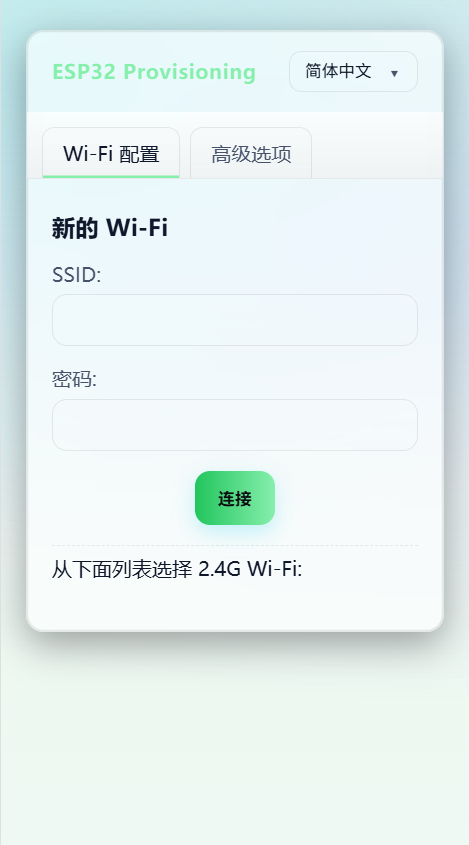
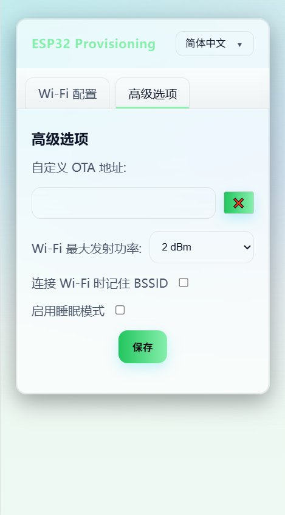

# 通过虾哥的封装修改
# ESP32 Wi‑Fi 连接

该组件封装了esp32的 Wi‑Fi 配网连接流程。

它会先使用存储在闪存中的凭据尝试连接 Wi‑Fi；如果失败，则启动接入点（AP）与 Web 服务器，供用户配置并连接到 Wi‑Fi 网络。

访问 Web 服务器的地址为 `http://192.168.4.1`。

## 截图：Wi‑Fi 配置



## 截图：高级选项



- 支持“ota”服务器自定义选项卡。
- 支持 "Connection: close" 响应头以节省打开的套接字。
- 支持语言请求。
- 支持 ESP32 SmartConfig（ESPTouch v2）。
- 支持多 Wi‑Fi SSID 管理。
- 自动切换到最佳 Wi‑Fi 网络。
- 提供用于 Wi‑Fi 配置的强制门户（Captive Portal）。
- 支持多语言（英语、中文）。

## Changelog: v3.0.0

- Added WifiManager class for unified WiFi connection management.
- Improved DnsServer and WifiConfigurationAp classes for better resource handling.
- Updated HTML for configuration success message to use exit endpoint instead of reboot.
- Enhanced error handling and state management in WifiStation.
- Cleaned up unused code and improved thread safety across components.

## 使用

```cpp
#include <wifi_manager.h>
#include <ssid_manager.h>

// Initialize the default event loop
ESP_ERROR_CHECK(esp_event_loop_create_default());

// Initialize NVS flash for Wi-Fi configuration
esp_err_t ret = nvs_flash_init();
if (ret == ESP_ERR_NVS_NO_FREE_PAGES || ret == ESP_ERR_NVS_NEW_VERSION_FOUND) {
    ESP_ERROR_CHECK(nvs_flash_erase());
    ret = nvs_flash_init();
}
ESP_ERROR_CHECK(ret);

// Get the WifiManager singleton
auto& wifi_manager = WifiManager::GetInstance();

// Initialize with configuration
WifiManagerConfig config;
config.ssid_prefix = "ESP32";  // AP mode SSID prefix
config.language = "zh-CN";     // Web UI language
wifi_manager.Initialize(config);

// Set event callback to handle WiFi events
wifi_manager.SetEventCallback([](WifiEvent event) {
    switch (event) {
        case WifiEvent::Scanning:
            ESP_LOGI("WiFi", "Scanning for networks...");
            break;
        case WifiEvent::Connecting:
            ESP_LOGI("WiFi", "Connecting to network...");
            break;
        case WifiEvent::Connected:
            ESP_LOGI("WiFi", "Connected successfully!");
            break;
        case WifiEvent::Disconnected:
            ESP_LOGW("WiFi", "Disconnected from network");
            break;
        case WifiEvent::ConfigModeEnter:
            ESP_LOGI("WiFi", "Entered config mode");
            break;
        case WifiEvent::ConfigModeExit:
            ESP_LOGI("WiFi", "Exited config mode");
            break;
    }
});

// Check if there are saved Wi-Fi credentials
auto& ssid_list = SsidManager::GetInstance().GetSsidList();
if (ssid_list.empty()) {
    // No credentials saved, start config AP mode
    wifi_manager.StartConfigAp();
} else {
    // Try to connect to the saved Wi-Fi network
    wifi_manager.StartStation();
}
```
